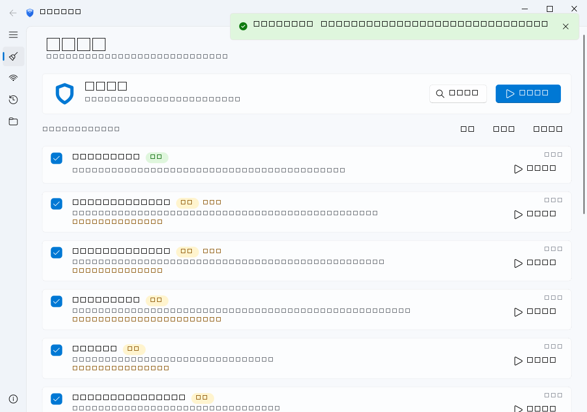
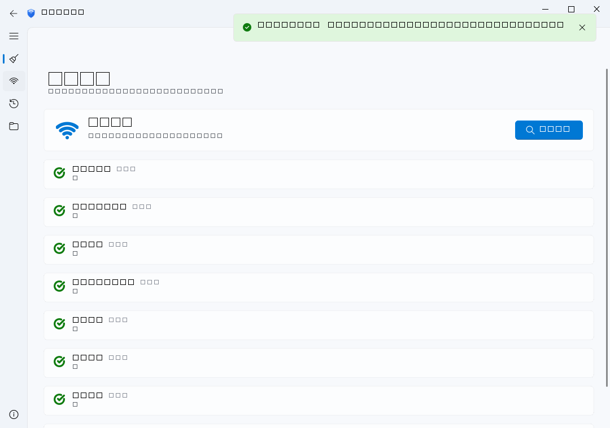
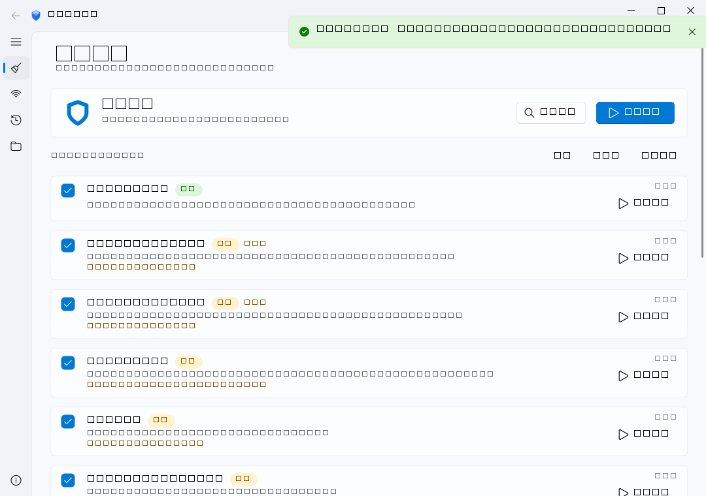

# 网络修复工具 NetRepair

> Windows 平台一键网络故障排查与修复工具 · 对标火绒「断网修复」· Fluent Design (Win11) 界面 · 纯本地运行

[](LICENSE)
[](https://www.python.org)
[](https://www.microsoft.com/windows)


**NetRepair** 是一个完全在本地运行的 Windows 网络修复桌面程序。它把常见的 `netsh` / `ipconfig` / PowerShell 网络修复操作封装成可视化的「一键修复」与「逐项修复」，并配套一套双路网络诊断，先定位病因再做最小修复。

> 全部操作基于系统自带命令，**不上传任何数据、不联网校验、不捆绑任何组件、不常驻后台**，可放心用于办公与生产环境排障。

---

## ✨ 功能特性

- **14 项修复能力**，覆盖 95% 的「能连 Wi‑Fi 但上不了网」场景：
  - 安全类（默认勾选）：刷新 DNS 缓存、清理 ARP/NetBIOS 缓存、修复网络系统服务、修复 Internet 选项
  - 常规类（默认勾选）：重置 Winsock、重置 TCP/IP 协议栈、修复默认网关、恢复 DNS 自动获取、重置浏览器代理、优化 TCP 全局参数
  - 谨慎类（需手动确认）：重置 Hosts 文件、重启网络适配器、重置 Windows 防火墙、清理路由表残留
- **10 项网络诊断（双路探测）**：同时走「直连 socket」与「系统代理路径」两条链路，对比定位病因（真断网 / 代理劫持 / DNS 故障 / LSP 损坏），仅对异常项给出自动勾选建议。
- **日志与备份**：修复前自动备份被修改的配置（Hosts、路由、防火墙策略等），日志落盘到 `%ProgramData%`，可追溯、可还原。
- **Fluent Design 界面**：基于 QFluentWidgets 的 Windows 11 风格，支持 Mica 云母背景、亚克力侧边栏、明暗主题自适应、5 套主题色。
- **零依赖分发**：PyInstaller 打包为单文件 exe，内嵌 UAC 提权清单，双击即请求管理员权限。

---

## 🖼️ 软件截图

| 关于页 | 修复页 | 诊断页 |
|---|---|---|
|  |  |  |

| 备份页 | 主题色切换 |
|---|---|
|  |  |

---

## 🚀 安装与运行

### 环境要求

| 项 | 要求 |
|---|---|
| 操作系统 | Windows 10 / 11（x64） |
| Python | 3.10+（推荐 3.13，开发环境使用 3.13） |
| 权限 | 修复网络配置需要 **管理员权限** |
| 运行依赖 | PySide6 + PySide6-Fluent-Widgets |

### 方式一：从源码运行（推荐给开发者）

```bash
# 1. 克隆仓库
git clone https://github.com/cv-superding/NetRepair.git
cd NetRepair

# 2. 创建虚拟环境并安装依赖
python -m venv venv
venv\Scripts\activate
pip install -r requirements.txt

# 3. 运行（建议右键「以管理员身份运行」终端，否则部分修复项会被跳过）
python main.py
```

### 方式二：直接下载 exe（推荐给普通用户）

前往 [Releases](https://github.com/cv-superding/NetRepair/releases) 下载最新的 `网络修复工具.exe`，双击运行并同意 UAC 提权即可，**无需安装任何依赖**。

### 打包为独立 exe（开发者）

```bash
# 安装打包依赖
pip install pyinstaller pillow

# 一键打包（生成 dist/网络修复工具.exe）
python build.py
```

打包产物为单文件 exe，内嵌 UAC `requireAdministrator` 清单与版本信息。

---

## 📖 使用指南

程序启动后分为五个页面：

1. **修复（首页）**：列出 14 项修复能力，每项标注风险等级（安全 / 常规 / 谨慎）。可点击「智能一键修复」（先跑诊断、自动勾选异常项），或逐项展开后单独修复。
2. **诊断**：运行 10 项双路探测，逐项显示 ✅/❌ 状态与病因结论；异常项可直接一键跳转修复页。
3. **备份**：查看与管理系统生成的配置备份（Hosts、路由表、防火墙策略等），支持一键还原。
4. **数据**：查看日志与备份目录占用，支持清理与打开所在文件夹。
5. **关于**：版本信息、作者信息（邮箱一键复制/发送）、外观设置（明暗主题 + 主题色）、开源许可与使用须知。

> 💡 **提示**：标记为「谨慎」的修复项会清除自定义配置（Hosts、防火墙策略、路由表等），执行前会自动备份，确认无误再点。

---

## 🗂️ 项目结构

```
NetRepair/
├── main.py                 # 程序入口：管理员提权 + 启动 GUI
├── build.py                # 打包脚本：生成图标 / 版本信息 / 调用 PyInstaller
├── requirements.txt        # 运行与打包依赖
├── LICENSE                 # GPLv3 全文
├── assets/                 # 图标源图与构建产物（app-icon-source.png 入仓，*.ico/*.txt 为生成物）
├── netfix/                 # 核心包
│   ├── __init__.py         # 包元信息（名称/版本/作者/许可）
│   ├── sysutil.py          # 底层工具：命令执行、管理员判定、日志、备份目录
│   ├── engine.py           # 14 个修复项实现（含备份与还原）
│   ├── diagnose.py         # 10 项网络诊断（双路探测 + 病因结论）
│   ├── icons.py            # 内嵌图标（base64，无需外部资源文件）
│   ├── theme.py            # 主题色与明暗主题辅助
│   ├── anim.py             # 界面动效辅助
│   └── ui.py               # Fluent Design 图形界面（5 个页面）
├── shots/                  # 界面截图（用于 README）
└── docs/                   # 设计调研（本地，不入仓）
```

---

## 🧩 技术架构

| 分层 | 说明 |
|---|---|
| **界面层 `ui.py`** | 基于 `FluentWindow` + QFluentWidgets 组件，5 个 `addSubInterface` 子页面；主题色与明暗主题全链路自适应。 |
| **业务层 `engine.py` / `diagnose.py`** | 纯函数式封装系统命令，不依赖 GUI；修复前自动备份、执行后可还原。 |
| **支撑层 `sysutil.py`** | 进程提权（`runas` / UAC）、命令执行与超时、日志（`%ProgramData%` 落盘）、备份目录管理。 |
| **资源层 `icons.py`** | 程序图标以 base64 内嵌，解决单文件 exe 找不到外部资源的问题；JPEG 无透明通道，运行时按亮度去白底。 |
| **打包 `build.py`** | 由 MJ 源图生成多尺寸 ICO 与版本信息，PyInstaller 单文件 + `--uac-admin`，依赖以 `--exclude-module` 精简体积。 |

**设计理念**：诊断与修复解耦——诊断只负责「定位病因并给出最小修复建议」，修复只负责「执行勾选项」，二者通过建议列表联动，避免「无差别全量修复」带来的不必要风险。

---

## 📝 日志与备份位置

| 类型 | 路径 |
|---|---|
| 运行日志 | `%ProgramData%\NetRepairTool\logs\` |
| 配置备份 | `%ProgramData%\NetRepairTool\backups\` |

可在「数据」页查看占用并一键打开所在文件夹。

---

## 🙏 设计参考（开源项目）

本项目在交互与实现上参考了以下优秀开源项目，在此致谢：

| 项目 | 可借鉴点 |
|------|---------|
| [AlexRabbit/Ultimate-Internet-Repair](https://github.com/AlexRabbit/Ultimate-Internet-Repair) | 29 步修复链、UAC manifest、`%ProgramData%` 日志落盘方案 |
| [scoggeshall/netsh-reset](https://github.com/scoggeshall/netsh-reset) | ARP/NetBIOS 缓存清理、防火墙与 WinHTTP 代理重置、带时间戳日志 |
| [JonathanAsf/internet-reset](https://github.com/JonathanAsf/internet-reset) | release/renew/registerdns + nbtstat 组合流程 |
| [dongsheng123132/Open365](https://github.com/dongsheng123132/Open365) | 「先诊断定位病因再做最小修复」的交互思路、连通性逐项亮灯 |

---

## ❓ 常见问题（FAQ）

**Q：为什么需要管理员权限？**
A：修复网络配置（重置 Winsock/TCP 协议栈、修改 Hosts、防火墙策略等）本质是修改系统设置，必须由管理员执行；未提权时程序仍可启动，但会跳过需提权的修复项并给出提示。

**Q：修复后还是上不了网？**
A：多为运营商线路或路由器/光猫故障，软件层面已尽力。请尝试重启光猫与路由器，或联系宽带客服。

**Q：会修改我的个人文件或上传数据吗？**
A：不会。所有操作仅作用于系统网络配置，且全部在本地执行；谨慎类操作执行前会自动备份，可随时还原。

**Q：杀软误报怎么办？**
A：单文件 exe 因内嵌 Python 运行时与提权清单，可能被部分杀软误报。源码完全公开，可自行 `python build.py` 重建校验；如确认误报，欢迎邮件反馈以便处理。

---

## 🤝 贡献指南

欢迎 Issue 与 Pull Request！

1. Fork 本仓库并克隆到本地。
2. 使用 `python -m venv venv && pip install -r requirements.txt` 准备环境。
3. 新建分支：`git checkout -b feature/your-feature`。
4. 保持代码风格一致，提交信息清晰。
5. 发起 Pull Request，描述改动动机与验证方式。

---

## 👤 作者与联系方式

**叶神鼬-丁**

- 邮箱：<2943629243@qq.com>
- GitHub：[@cv-superding](https://github.com/cv-superding)

使用中遇到问题、发现误报或有功能建议，欢迎邮件反馈。

---

## 📄 许可证

本项目采用 **GNU General Public License v3.0** 授权，完整条款见 [LICENSE](LICENSE)。

```
Copyright (C) 2026 叶神鼬-丁

This program is free software: you can redistribute it and/or modify it
under the terms of the GNU General Public License as published by the
Free Software Foundation, either version 3 of the License, or (at your
option) any later version.

This program is distributed in the hope that it will be useful, but
WITHOUT ANY WARRANTY; without even the implied warranty of MERCHANTABILITY
or FITNESS FOR A PARTICULAR PURPOSE. See the GNU General Public License for more details.
```

> **为什么是 GPLv3**：界面组件库 QFluentWidgets 采用 GPLv3 授权，依据其传染性（copyleft）条款，本项目在对外分发时必须同样以 GPLv3 开源。若仅自己使用、不做任何分发，则不触发该义务。

### 第三方组件许可

| 组件 | 许可证 |
|---|---|
| [PySide6](https://doc.qt.io/qtforpython/) | LGPLv3 |
| [PySide6-Fluent-Widgets](https://qfluentwidgets.com) | GPLv3 |
| [PyInstaller](https://pyinstaller.org) | GPLv2 + 例外条款（打包产物不受传染） |

---

## ⚠️ 免责声明

本软件按「原样」提供，作者不对因使用本软件造成的任何直接或间接损失负责。涉及系统级网络配置的修复存在一定风险，请在执行前确认已备份重要配置，并仅在理解相关操作后果的前提下使用。
